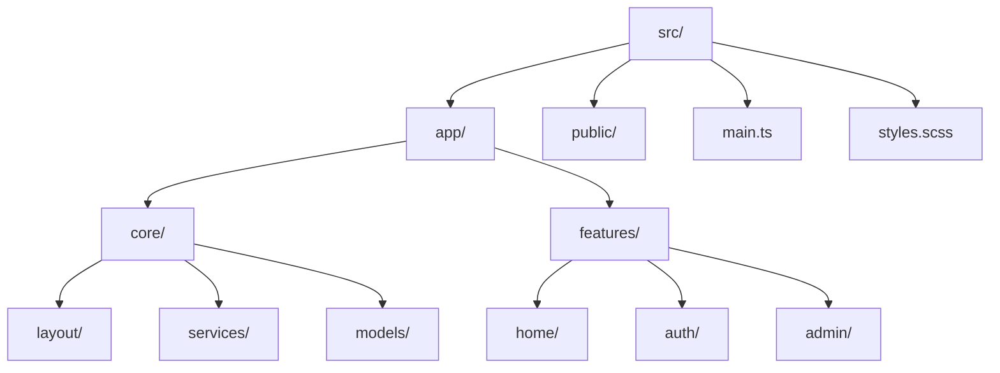
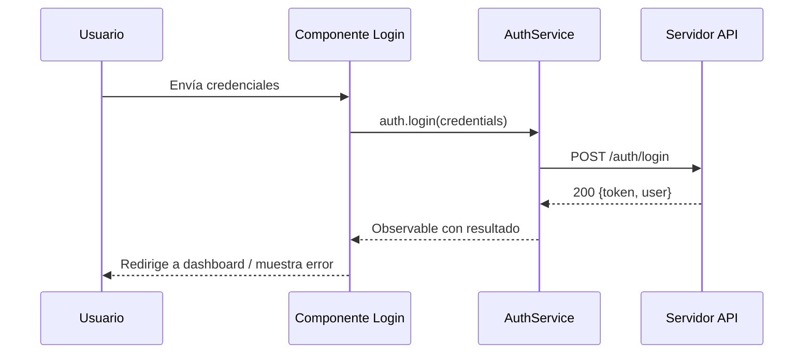

# Arquitectura del frontend

Este documento resume la arquitectura de la aplicación Angular incluida en este repositorio.

## Visión general

La aplicación sigue una arquitectura modular por características (feature modules) y una capa `core` para lógica compartida. Los activos estáticos están en `public/` y son servidos/copied al `dist/` durante el build.

Objetivos:
- Separación clara entre presentación, lógica de negocio y servicios.
- Reutilización mediante servicios y modelos en `core`.
- Estructura por características para facilitar escalabilidad.

## Diagramas (Mermaid)

A continuación hay tres diagramas Mermaid que representan la arquitectura general, la estructura de carpetas y el flujo de autenticación (login).

### 1) Arquitectura general

```mermaid
graph TD
  subgraph Cliente
    A[Browser / App] --> B[App Shell (main.ts, index.html)]
    B --> C[Feature Modules]
  end
  subgraph Aplicación
    C --> D[core/services]
    C --> E[core/models]
    C --> F[features/*]
  end
  subgraph Backend
    G[API REST] -.-> H[Base de datos]
  end
  D -->|HTTP/REST| G
  F -->|Inyección de Servicios| D
  style Cliente fill:#f9f,stroke:#333,stroke-width:1px
  style Aplicación fill:#fffbcc,stroke:#333,stroke-width:1px
  style Backend fill:#ccf,stroke:#333,stroke-width:1px
```

### 2) Estructura de carpetas (resumen)



### 3) Flujo de autenticación (login)



## Carpetas principales

- `src/app/core/` — Contiene servicios, modelos y componentes de layout reutilizables.
  - `layout/` — Header y footer (componentes compartidos).
  - `services/` — Servicios como `auth-service.ts`, `user.service.ts`.
  - `models/` — Modelos TypeScript (usuarios, login, servicios).

- `src/app/features/` — Implementaciones por característica:
  - `home/` — Páginas de inicio, hero, contacto, servicios, etc.
  - `auth/` — Login, registro y recuperación de contraseña.
  - `admin/` — Vistas y herramientas administrativas (gestión de usuarios y servicios).

- `src/` — Entradas como `main.ts`, `index.html`, `styles.scss`.
- `public/` — Imágenes y recursos estáticos (copiados al build según `angular.json`).

## Componentes clave (desmenuzado)

Aquí se describen los componentes más relevantes y su responsabilidad.

- `app/core/layout/header.ts` — Componente de navegación superior. Responsable de mostrar enlaces, estado de autenticación y menú responsivo.
- `app/core/layout/footer.ts` — Pie de página común con enlaces y créditos.
- `app/features/home/home.ts` — Página principal que orquesta los subcomponentes `hero`, `servicios` y `contact`.
- `app/features/auth/login.ts` — Formulario de login; utiliza `customvalidation.service.ts` para validaciones y `auth-service.ts` para autenticación.

Buenas prácticas:
- Componentes pequeños y enfocados: un componente = una responsabilidad.
- Preferir comunicación Input/Output entre componentes padre-hijo; usar servicios para estado compartido o global.

## Servicios y contratos

Servicios en `core/services` centralizan llamadas a la API y lógica compartida.

- `auth-service.ts`:
  - Métodos esperados: `login(credentials): Observable<AuthResult>`, `logout()`, `isAuthenticated(): boolean`, `getToken(): string | null`.
  - Debe almacenar token en `localStorage`/`sessionStorage` o manejarlo mediante un servicio de sesión.

- `user.service.ts`:
  - Métodos: `getUser(id): Observable<User>`, `listUsers(): Observable<User[]>`, `updateUser(user): Observable<User>`.

- `customvalidation.service.ts`:
  - Validador reutilizable para formularios (email, password strength, matching fields).

Contrato de datos (ejemplos):

```ts
// User
interface User {
  id: number;
  name: string;
  email: string;
  role?: string; // 'admin' | 'user'
}

// AuthResult
interface AuthResult {
  token: string;
  user: User;
}
```

## Modelos

Los modelos en `core/models` deberían ser leves y, de ser necesario, incluir helpers para transformación entre API y UI.

- `user.model.ts` — Representa al usuario y helpers (por ejemplo `getFullName()` si se requiere).
- `servicio.ts` — Modelo para los servicios ofrecidos (titulo, descripción, imagen, estado).

## Patrones y recomendaciones

- Modularización: cada feature dentro de `features/` puede convertirse en un módulo Angular independiente (lazy-loading) para mejorar tiempos de carga.
- State handling: para estado compartido complejo, considerar NgRx o un service store local con Subjects/BehaviorSubjects.
- Error handling: usar interceptores HTTP para manejar errores, refresh de token y retry en errores transitorios.
- Seguridad: nunca almacenar datos sensibles sin cifrado; usa HttpOnly cookies para tokens cuando sea posible.

## Testing (estrategia y enfoque)

- Unit tests:
  - Probar servicios con HttpClientTestingModule.
  - Mockear dependencias y probar lógica (por ejemplo validadores en `customvalidation.service.ts`).

- Component tests:
  - Crear pruebas para componentes que contienen lógica (login, admin-services).
  - Usar TestBed y fixture para detectar cambios y simular eventos.

- End-to-end (opcional):
  - Añadir Playwright o Cypress para flujos críticos (login, CRUD de servicios).

## Ejemplo rápido: contrato de login

Petición:

POST /auth/login
Body: { email: string, password: string }

Respuesta esperada (200):

{ token: string, user: { id, name, email, role } }


## Flujo de datos y servicios

- La comunicación con APIs externas se realiza típicamente mediante servicios en `core/services`. Estos servicios usan `HttpClient` (no incluido explícitamente en este repo, pero estándar en Angular) para hacer peticiones REST.
- Los componentes consumen servicios a través de inyección de dependencias y reciben datos en forma de Observables (RxJS). La UI se suscribe o utiliza el pipe `async` para consumir dichos Observables.

## Convenciones

- Estilos: SCSS para componentes y estilos globales en `src/styles.scss`.
- Nombres: Las carpetas de características usan nombres en plural (`features`, `services`).
- Tests: Archivos `.spec.ts` acompañan varios componentes y servicios para pruebas unitarias con Karma/Jasmine.

## Build y despliegue

- El build está configurado en `angular.json`. Los assets en `public/` se incluyen automáticamente.
- Para crear una versión de producción ejecutar `npm run build` — el resultado se encuentra en `dist/`.

## Extensiones y mejoras sugeridas

- Añadir un módulo compartido (`shared/`) para componentes y pipes reutilizables.
- Implementar manejo centralizado de errores en un interceptor HTTP.
- Añadir documentación de las API (por ejemplo OpenAPI) y un servicio genérico para llamadas a la API.
